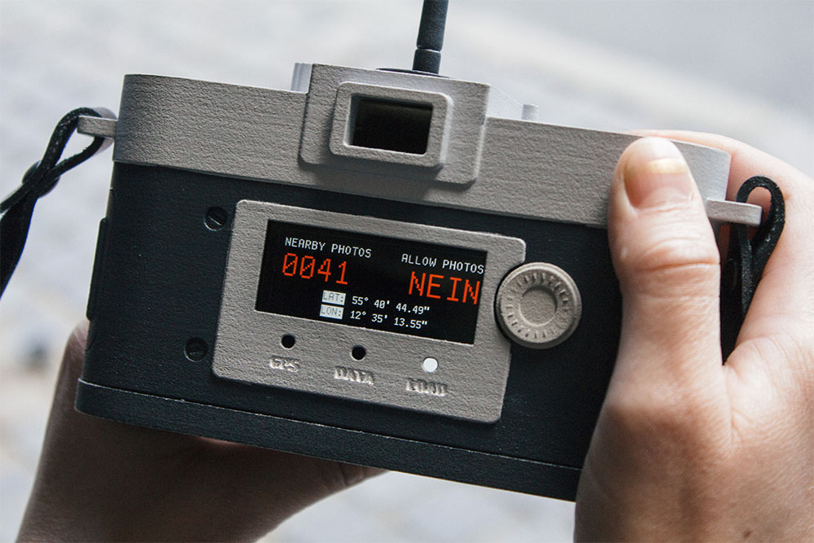
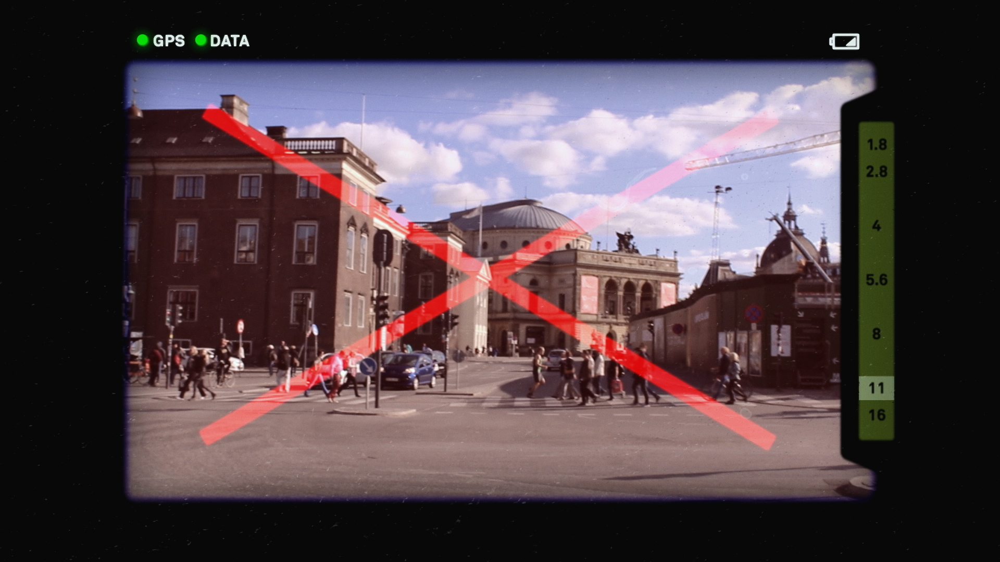

# Conceptual Cameras

This lecture is intended to provoke reconsiderations about what a camera "is" or could be. 

-- 

### The Descriptive Camera

*[The Descriptive Camera](http://mattrichardson.com/Descriptive-Camera/)* by Matt Richardson works a lot like a regular camera: point it at subject and press the shutter button to capture the scene. However, instead of producing an image, this prototype uses crowdsourcing to output a text description of the scene. 

 

--

### Word.Camera

*[Word.Camera](https://word.camera/about)* by Ross Goodwin  sends the image it takes to a crude artificial intelligence, that then attempts to describe it in English. It uses convolutional neural networks (via Clarifai) to extract concept words from images; itn then expands those initial words (mostly nouns) into sentences and paragraphs using a lexical relationship database (ConceptNet) and a flexible template system.

 

Ross Goodwin has also made a similar [Sentient Surveillance Camera](http://motherboard.vice.com/read/sentient-surveillance-camera).

-- 

### Camera Restricta

*[Camera Restricta](http://philippschmitt.com/projects/camera-restricta)* by Philipp Schmitt is a 'disobedient' camera designed to take unique photographs. By using data of geotagged photos the camera will refuse to operate in popular places.

 
 

Closely related to this project is *[The Unoptic Camera](http://cl.ly/1h2Q0q0h1J32)* by Kyle McDonald and Chris Woebken.

-- 

### Nadia, Camera Intelligent Interface

[Nadia, Camera Intelligent Interface](https://www.youtube.com/watch?v=ColrQao4Hlg) by Andrew Kupresanin (2010) is a critic-in-a-camera. "Unlike a conventional camera, Nadia has no display of the photographs to be taken, but rather gives the judgment of aesthetic quality to the machine, displaying only a current rating as feedback about when and what to snap. Within pop culture and society artificial intelligence has been a topic that is approached with hope, fear, cynicism, curiousity and caution."

 

--

### Image Fulgurator

Julius von Bismarck's *[Image Fulgurator](http://juliusvonbismarck.com/fulgurator/)* (2007) is a device for physically manipulating photographs. It intervenes when a photo is being taken, without the photographer being able to detect anything. The manipulation is only visible on the photo afterwards.

 

von Bismarck writes: 

> In principle, the Fulgurator can be used anywhere where there is another camera nearby that is being used with a flash. It operates via a kind of reactive flash projection that enables an image to be projected on an object exactly at the moment when someone else is photographing it. The intervention is unobtrusive because it takes only a few milliseconds. Every photo another photographer takes of an object at which the Fulgurator is also aimed is affected by the manipulation. Hence visual information can be smuggled unnoticed into the images of others.

