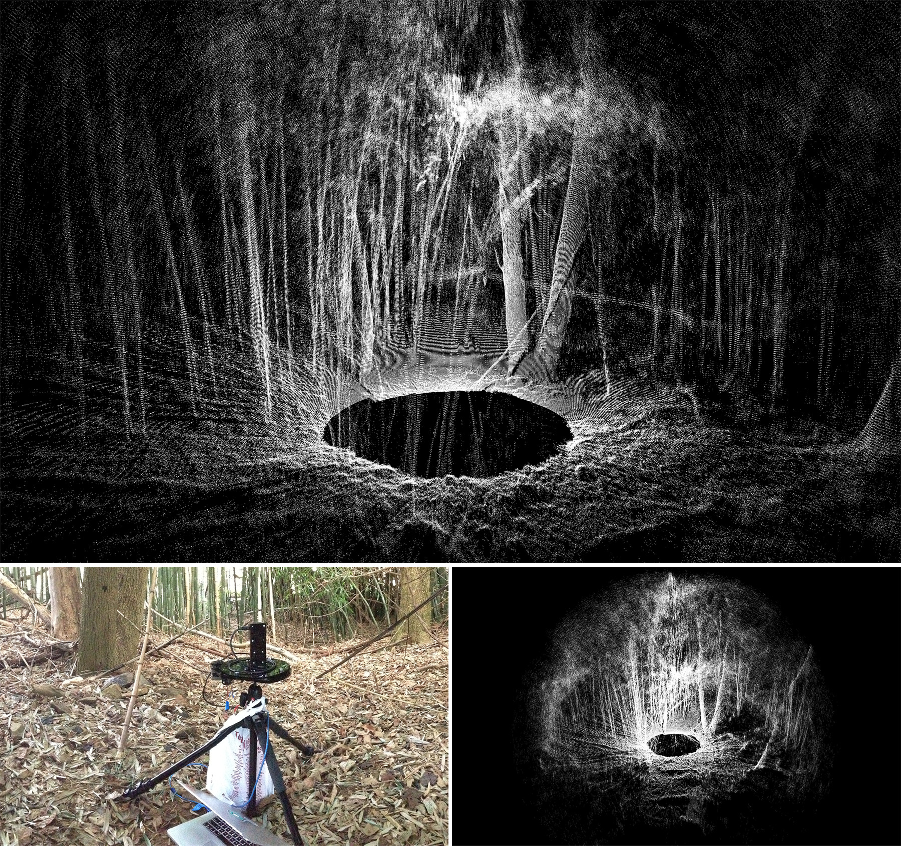
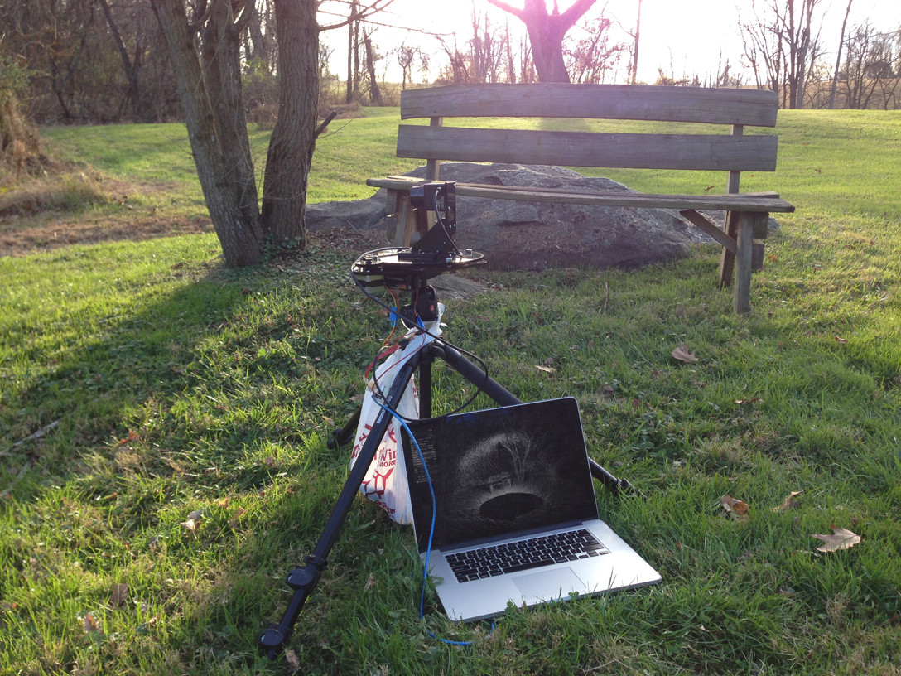
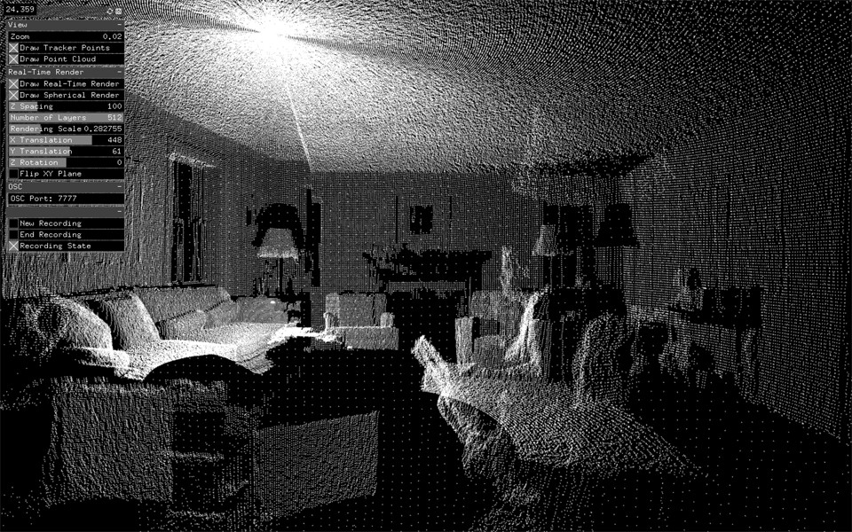
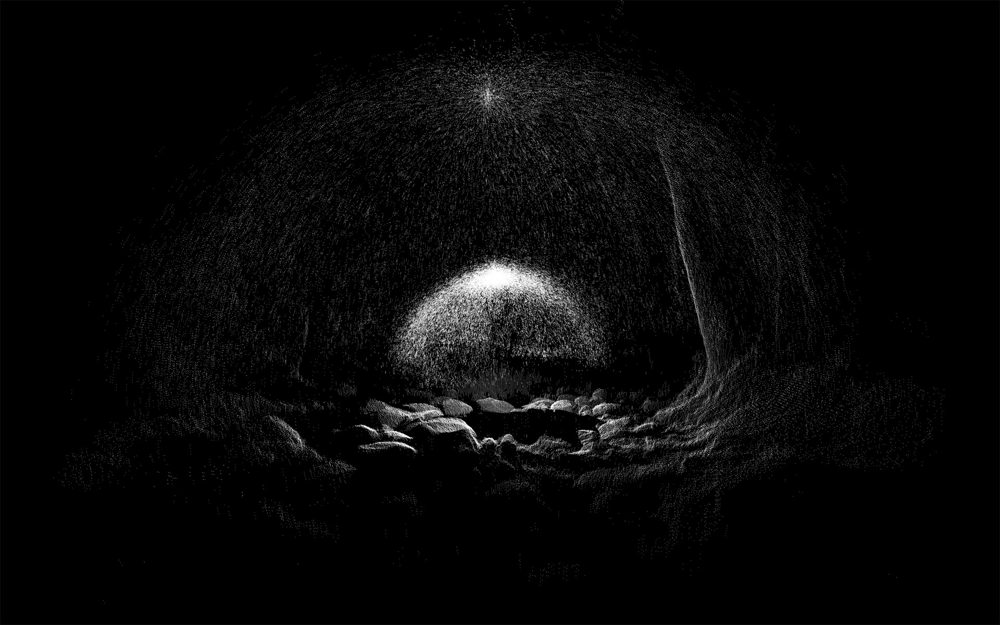
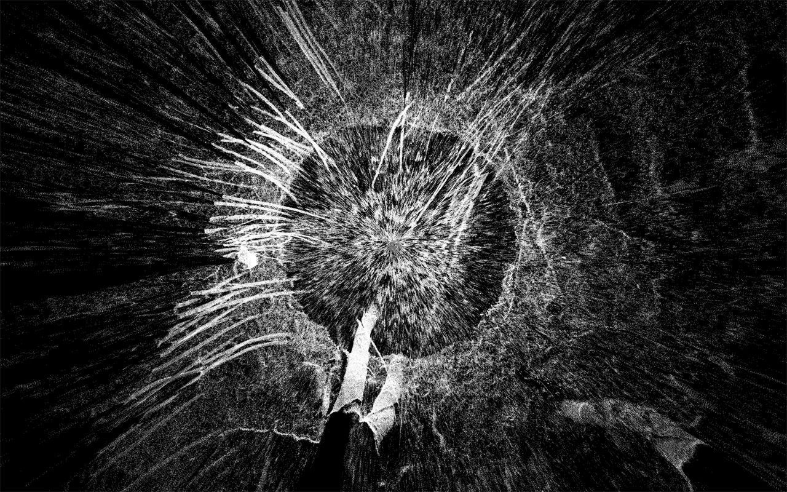
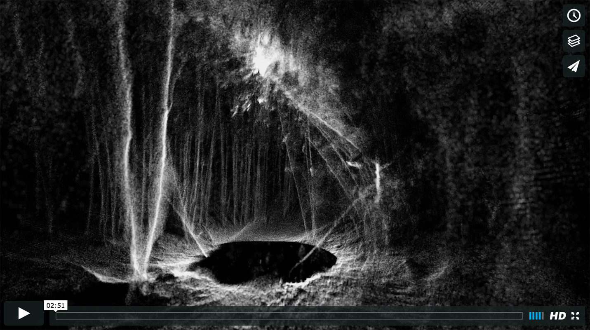
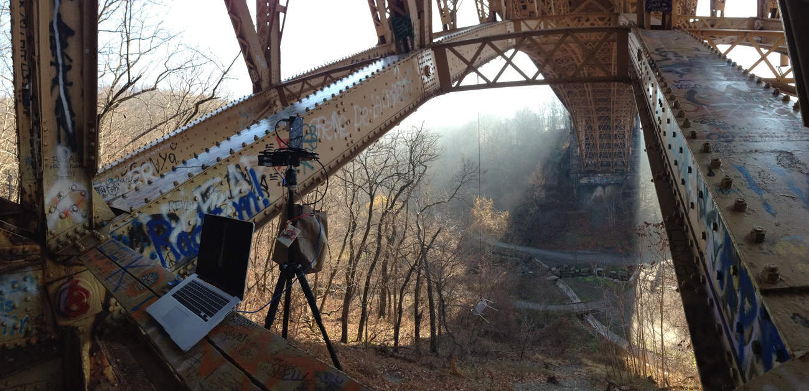
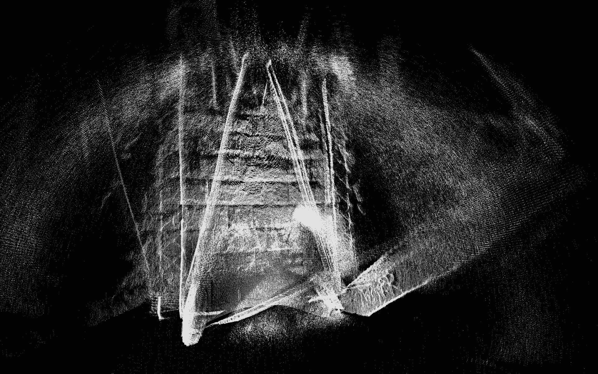
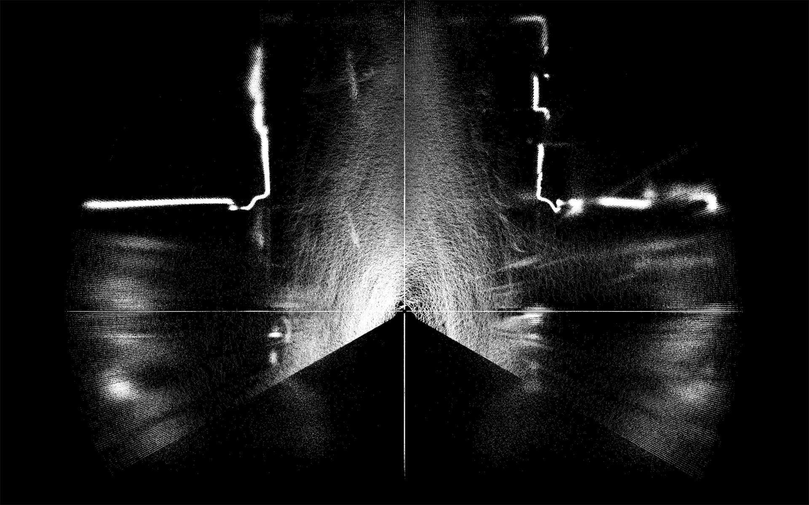
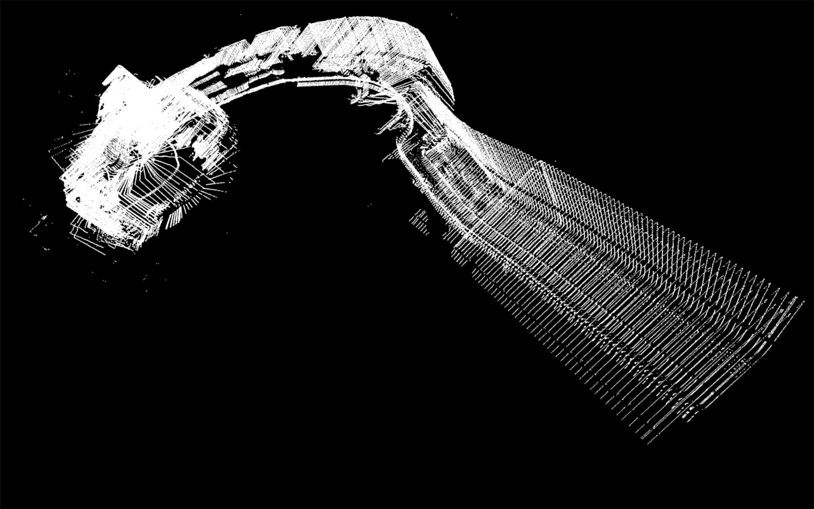

#Lidar Photography, Part II
###Temporalized Spaces and Visualizations

*Experimental Capture Final Project, continuation of [Project 3](https://github.com/golanlevin/ExperimentalCapture/blob/master/students/benjamin/Project%203/Project%203.md)*

###Index
- [Overview](#overview)
- [Static Spherical Capture: Nature, Bamboo Forest](#spherical_farm)
- [Experiments in Synthesis: Bamboo Forest](#spherical_synthesis)
- [Static Spherical Capture: Bridge](#spherical_bridge)
- [Horizontal Static Scanning: Building Entrance](#doherty_entrance)
- [Dynamic Orientation Tracking, cont'd](#dynamic_orientation_2)
- [Tech Specs](#tech)
- [Code](#code)
- [Lidar Mounts: Laser Cutter Files](#mount)

*See these images in high resolution [here](https://www.flickr.com/gp/138824118@N08/G09R5Z).*

--

### <a name="overview">Overview</a>
LIDAR is a light-based rangefinding technology, similar to sonar or radar. The model I used, the Hokuyo URG-04LX-UG01, uses pulses of near infrared light to determine the depth of objects along a plane within its 240˚ field of view.

Here, I've continued to have a conversation with this piece of technology, taking it out of the context in which it typically belongs to reveal the unseen and the unexpected.

Since the device only captures the world in two dimensions, capturing a space requires the scans to be extruded through time—a technique known as slitscanning. The way in which captures are extruded, often tied to how a subject is scanned, unearths temporal artifacts that reveal peculiar and surprising interpetations of the world in which we live.

--

###<a name="spherical_farm">Static Spherical Capture: Nature, Bamboo Forest</a>

With a lidar so powerful yet so nimble, the question must be asked: Can you capture a full 360˚ field of view?

I first set out to design a rig that could rotate the lidar with the laser in line with a vertical axis around which the lidar "fan", when pointed upward, could rotate about. The gear reductions allow the horizontal resolution to be the same or higher than the vertical resolution, producing a homogenously dense point cloud along the latitude and slightly denser points toward the poles. The rotation is controlled with a NEMA 17 stepper motor and an Arduino with Pololu A4988 motor driver.

To put the rig to use, I captured a series of still outdoor scenes in bamboo forests, creek beds, and fields of grass on a small farm in northern Virginia.

The results are quite spectacular. An interesting artifact of the outside captures are the "domes" of points, which represent the lidar's interpretation of sunlight. This is analogous to lens glare, but in three dimensions.

The above scans are taken at an equal resolution horizontally and vertically. This takes 51.2 seconds and produces a point cloud of about 350k points. The highest resolution I scanned at is at 8 times this, resulting in a point cloud of over 3 million points. The below image reflects this, taken in a dense bamboo forest. Everything within 18 feet in view of the lidar is pictured here.

[See high resolution images here.](https://www.flickr.com/gp/138824118@N08/G09R5Z)

--
###<a name="spherical_synthesis">Experiments in Synthesis: Bamboo Forest</a>

Using the high resolution point cloud of the bamboo forest, I sought to animate the three million particles to imbue the scene with a sense of liveliness.

--

###<a name="spherical_bridge">Static Spherical Capture: Bridge</a>

A 360 capture underneath the Schenley Park bridge. Terrifying.

--

### <a name="doherty_entrance">Horizontal Static Scanning: Building Entrance</a>

At the recommendation of Golan, I scanned the entrance to Doherty Hall, right before class got out. The lidar was positioned such that the scan fanned our horizontally, parallel to the ground plane, at about chest height. This time, the extrusion is not horizontal, but vertical through time.

Each of the snake-like forms represents the path of one person. Though the forms that arise on the order of seconds are interesting, even more so are those which accumulate over an hour. 

The paths we collectively take are visualized. The structure of our environment and our relationship to it becomes apparent.

--

### <a name="dynamic_orientation_2">Dynamic Orientation Tracking Demo</a>

To demonstrate that dynamic relative orientation tracking is possible, I traversed a room counterclockwise at a constant speed with the lidar pointed to my right. The forms are not highly accurate, as constant speed is assumed and position integrated over previous orientaitons. However, there is clearly semblance of form.

Most importantly, the process of capture revealed the difficulty of succssfully using the [RAZOR IMU](https://www.sparkfun.com/products/10736), as there's a large amount of recalibration required to successfully compensate for the surrounding metal and magnetized objects, the position of which change depending on the rig used and local gravitational differences.

--

### <a name="tech">Tech Specs</a>

**LIDAR: [Hokuyo URG-04LX-UG01](https://www.hokuyo-aut.jp/02sensor/07scanner/urg_04lx_ug01.html)**

- 240˚ field of view 
- 0.35˚ resolution
- 682 points per scan
- 10Hz refresh rate (~10 scans per second)

**[OpenFrameworks](http://openframeworks.cc/) (v8.4)**

- Dan Moore's [ofxURG](https://github.com/danthemellowman/ofxUrg) Library for reading data from the lidar

--

###<a name="code">Code</a>

All my code for recording and displaying URG lidar data can be found [here](https://github.com/bensnell/urg-recording-and-display).

--

###<a name="mount">Lidar Mounts: Laser Cutter Files</a>

[Here's an SVG file](assets/Rotating Lidar Mount.svg) for making your own freely rotating lidar mount. Note: the lidar only needs to rotate 180˚ to take a full 360˚ capture, since it's pointed upwards and rotating about a vertical axis.

You'll also need an Arduino to make the motor run. [Here's the code I used for an A4988 stepper motor driver.](assets/Stepper_Motor_and_LIDAR.ino)

--

Many thanks to Golan Levin for endless ideas, support, and inspiration!

