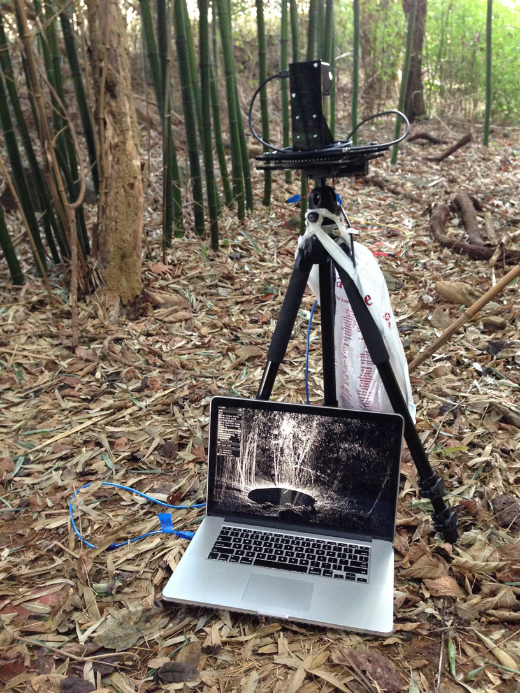
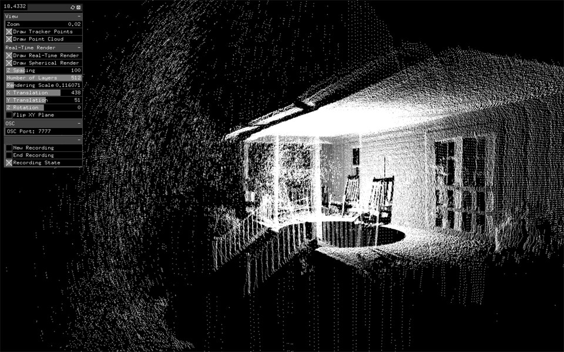
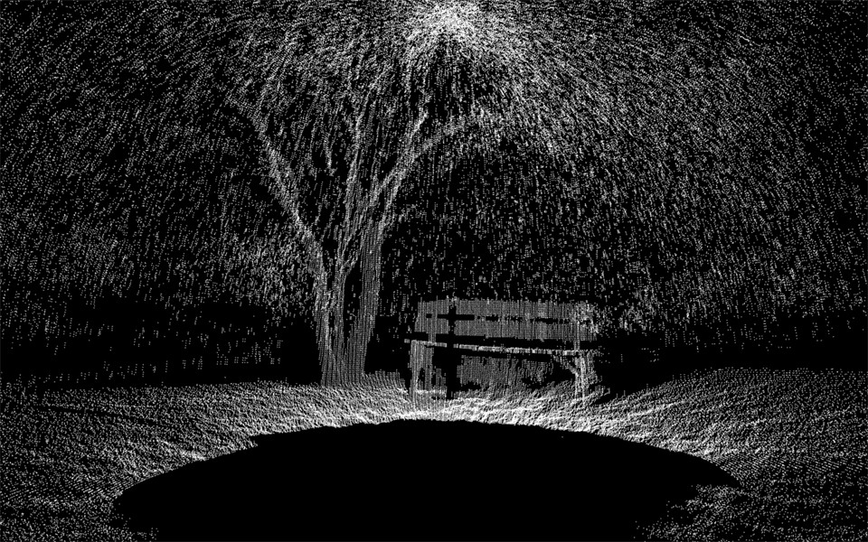
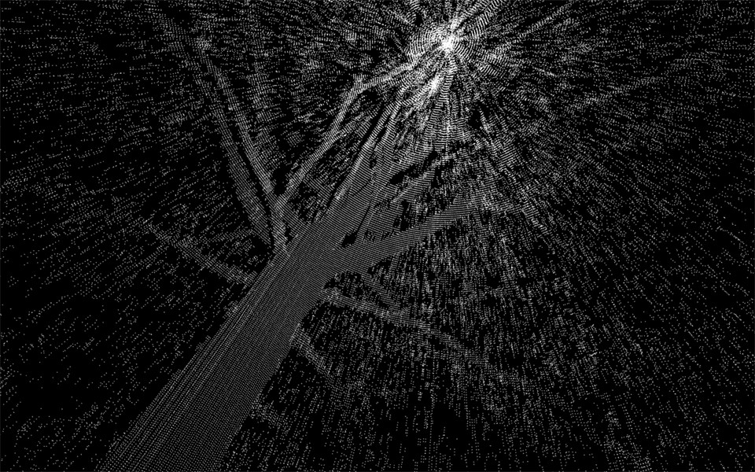
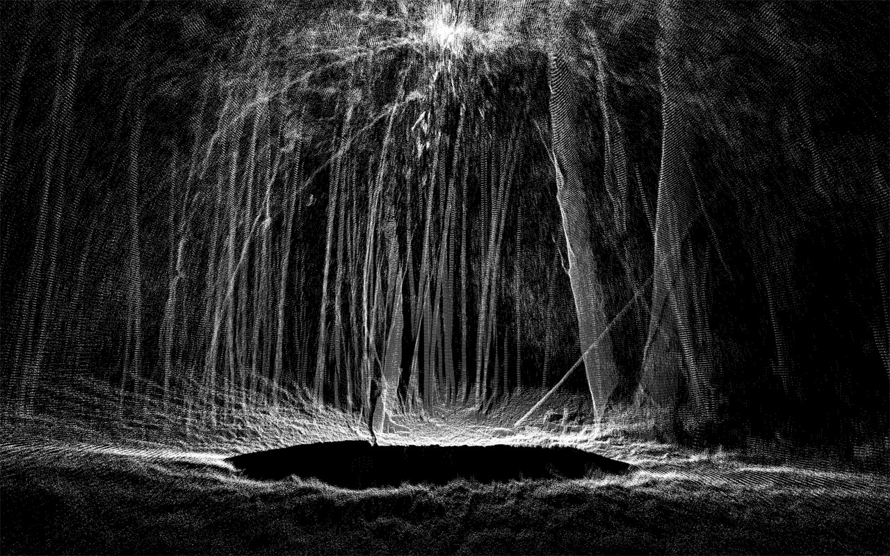
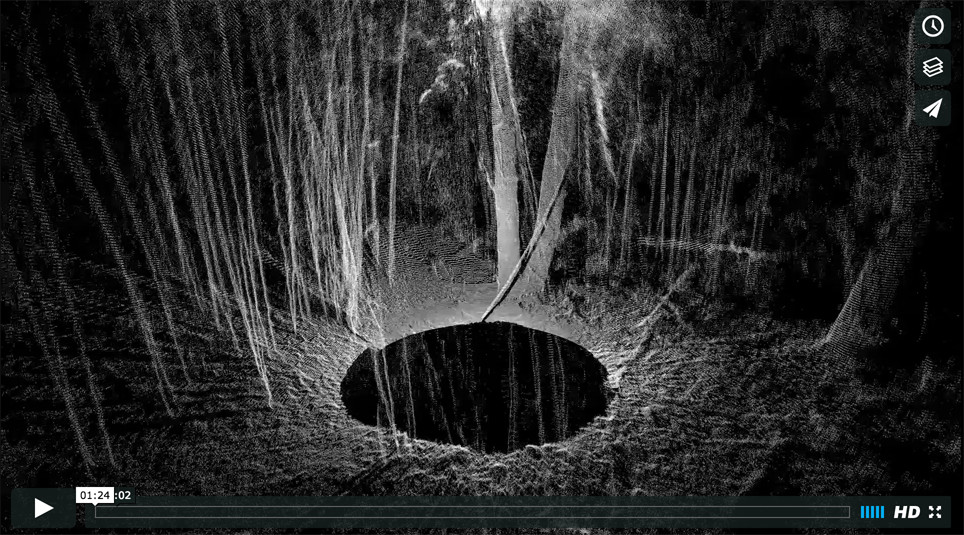

#Lidar Photography (cont'd)

###*Final Project, continuation of [Project 3](https://github.com/golanlevin/ExperimentalCapture/blob/master/students/benjamin/Project%203/Project%203.md)*
--

*Horizontal Static Scanning*

At the recommendation of Golan, I scanned the entrance to Doherty Hall, right before class got out. The lidar was positioned such that the scan fanned our horizontally, parallel to the ground plane, at about chest height. This time, the extrusion is not horizontal, but vertical through time.

Each of the snake-like forms represents the path of one person. Though the forms that arise on the order of seconds are interesting, even more so are those which accumulate over an hour. 

The paths we collectively take are visualized. The structure of our environment and our relationship to it becomes apparent.

--

*Dynamic Orientation Tracking Demo*

To demonstrate that dynamic relative orientation tracking is possible, I traversed a room counterclockwise at a constant speed with the lidar pointed to my right. The forms are not highly accurate, as constant speed is assumed and position integrated over previous orientaitons. However, there is clearly semblance of form.

Most importantly, the process of capture revealed the difficulty of succssfully using the RAZOR IMU, as there's a large amount of recalibration required to successfully compensate for the surrounding metal and magnetized objects, the position of which change depending on the rig used and local gravitational differences.

--

*Static Spherical Capture*

With a lidar so powerful yet so nimble, the question must be asked: Can you capture a full 360˚ field of view?

I first set out to design a rig that could rotate the lidar with the laser in line with a vertical axis around which the lidar "fan", when pointed upward, could rotate about. The gear reductions allow the horizontal resolution to be the same or higher than the vertical resolution, producing a homogenously dense point cloud along the lines of latitude and denser points closer to the poles. The rotation is controlled with a NEMA 17 stepper motor and an Arduino with Pololu A4988 motor driver.

To put the rig to use, I captured a series of still outdoor scenes in bamboo forests, creek beds, and fields of grass on a small farm in northern Virginia.

The results are quite spectacular. 

The above scans are taken at an equal resolution horizontally and vertically. This takes 51.2 seconds and produces a point cloud of about 350k points. The highest resolution I scanned at is at 8 times this, resulting in a point cloud of over 3 million points. The below image reflects this, taken in a dense bamboo forest. Everything within 18 feet in view of the lidar is pictured here.

