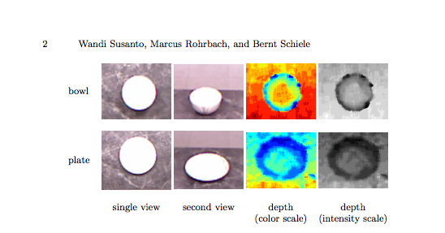

#Looking Outwards 5

## Hole Filling Strategy for Kinect Depth Maps

[Link to article](https://www.mpi-inf.mpg.de/fileadmin/inf/d2/Research_projects_files/wandi12eccv.pdf)

Authors: Wandi Susanto, Marcus Rohrbach, and Bernt Schiele
 At Max Planck Institute for Informatics, Saarbr¨ucken, Germany

This method uses both the depth data with the RGB data and combines both to get a "vote" across multiple cameras which represents the depth information.
Note that this tactic is good for cluttered scenes. Otherwise either depth or RGB data is good enough alone.

The steps:

1. Mount Kinects & other setup
 - They calibrate the extrinsic matrix between different Kinect cameras using ICP
from the PCL
2. Get strong visual cues from color images by using the deformable part model (DPM)
3. Combine together with the viewpoint feature histogram (VFH) extracted from depth based point clouds
 - The histogram is made: For a given bounding box we extract the 3D point cloud descriptor viewpoint feature histogram (VFH)
4. For classification it agrees on the spot of the object using an average (DPM scores) of all the different places it detected it in the color data. The depth data classification is used to verify the location and what it is. 

Interesting take aways:

* The accuracy in the classification does not significantly improve after 8 kinects are installed. So 8 views is the least amount of views with the most out of it. 
* Works in real time.
* Works with occluded objects. Can Identify the occluder vs what is being occluded
* the depth data can be smoothed out by taking the mean over 9 depth frames.
* Large angles between Kinects hampers the disturbance from different IR light patterns
* This paper references more conclusive research papers that are useful.