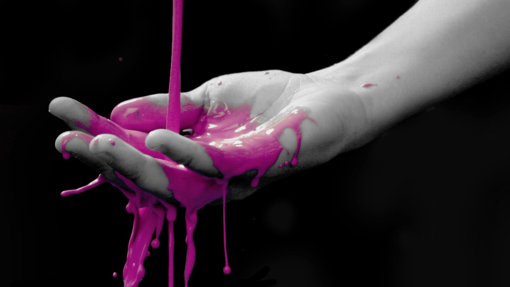
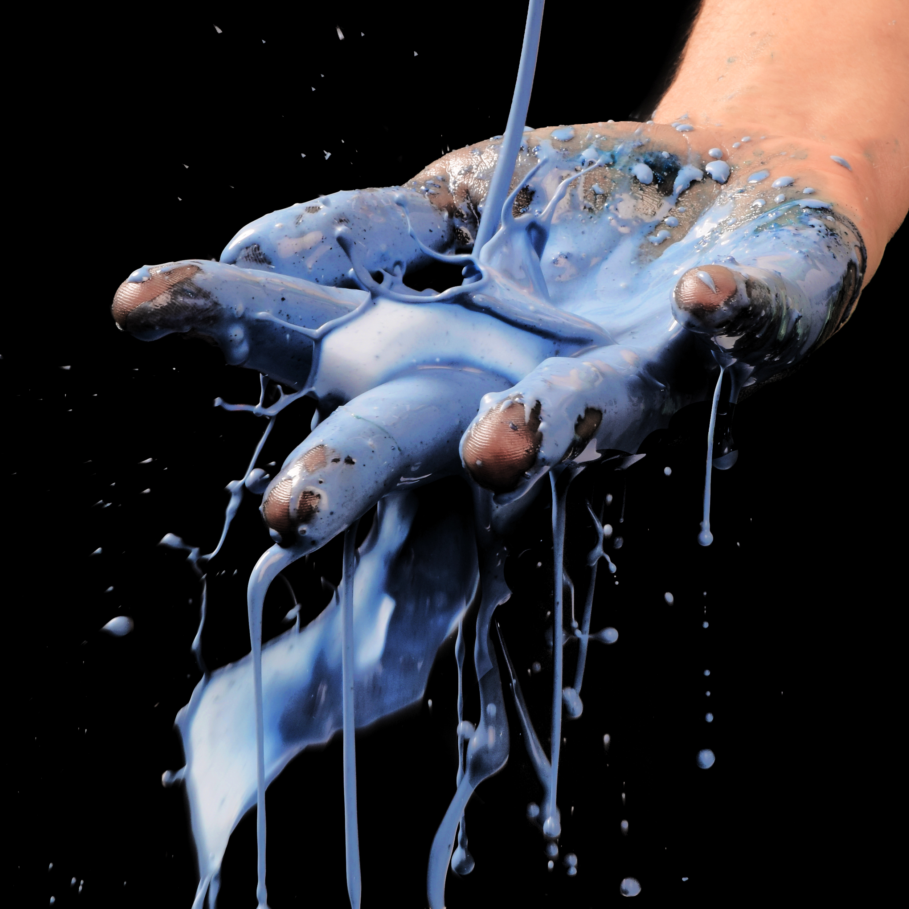
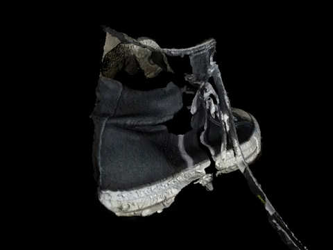

Smokey and Irene's Assignment 1 
===============================
3D photogrammetry is a technique for constructing a three dimensional model of an object using many photos of the object from different angles. High speed photography is a technique for freezing motion, using a flash or other means of limiting the duration light can hit a sensor to an extremly short (read: "instant") period of time. Both tools are very powerful, and we combined them together. 

High speed photography freezes motion, but presents a new challenge: how to capture multiple angles. The obvious solution: use multiple cameras.

# The Goal
To be able to create 3D models of objets that are otherwise extremely difficult to model, such as the behavior of liquids. High speed photography reveals to us beautiful moments that are invisible to the naked eye, and 3D scans give us an ability to manipulate the objects.

Smokey is particularly interested in using this tool as a compositing aide to create "pretty 3D renders of pretty things", while Irene enjoyed learning about photogrammetry and failed camera alignments. 

[Project Video](https://vimeo.com/140151342)

---

# Challenges

## Spherical Lighting
We set up 15 DSLR cameras along 2 rings around - and pointed towards - an object. We also set up 4 flash bulbs, 2 of them diffused (a softbox and a beauty fish) to provide even lighting and ensure no part of the object was too dark, and 2 of them hard light to ensure the objects had depth and contrast that the photogrammetry software can utilize. The rest of the area was filled by the uncovered flash bouncing off of the wall opposite of the diffused light sources. This setup garunteed consistent lighting accross all of the object's angles, while still having a sense of depth.

## Camera Triggering
We used all kinds of camera models: old Canons, new Canons, old Nikons, new Nikons. This made using USB cables and custom software to tether all those cameras highly impractical. Triggering the cameras with Infared light did not give us the precision or reliability we required, and we did not have the means to manufacture a rig to accuratley electronically trigger the cameras through the sync port. Casting these limitations aside, we opted for a lower-tech, but clever solution.

When one does flash photography, the final exposure of the image is a combinaton of ambient light and flash light. The shutter speed controls *only* the quantity of ambient light, as all of the light from the flash is obtained at nearly the same instant. By removing nearly all ambient light, stopping down the aperture of the cameras, and increasing the flash strength to compensate, very long shutter speeds could be achieved. This was at some sacrifice - more powerful flashes do last slightly longer than a flash at a weaker setting - but for our purposes the action was still adequately 'frozen'.

With 8-10 second shutter speeds, we could manually trigger the shutter on all of the cameras (except for the one controlling the flash). If this takes 4 seconds, there is a 4 second window to fire the flash.

The camera with the flash itself was triggered through a triggertrap, which connected the camera to a phone's sound sensor. The person handling the action (splashing/pouring the liquid or tossing the shoe) needs merely to yell "bang" during the instant they believe will be most beautiful.

This low tech and inelegant (yet clever) solution prevented us away from getting tangled with a million wires. All we needed was a little assistance (thanks Charlotte, Chaoya, others!) and some practice (which consumed time).

# Solutions to Sparse Photogrammetry
While 15 DSLR cameras (not to mention tripods, arms, lightstands, etc) is a large and cumbersome system to handle, in the world of photogrammetry, 15 is actually rather small. We hit an immedeate problem: the lack of overlap between the images prevented the software (Agisoft PhotoScan) from accuratey being able to place the images in 3D space. Here are some tricks we discovered for generating better images from models.

## Use Markers
Adding markers to signify 'This point is HERE' accross images to manually aide the process of image alignment is a simple enough process, although tedious.

## Use Masks
Using Masks removing all extrateraneous and confusing data that the software may struggle with matching greatly aids the process - although it takes trial and error to see just what sorts of objects in the scene are confusing the software.

## Increase source image contrast
A batch Photoshop job to increase the contrast on all of the images is an easy way to greatly aid the software's ability to align the cameras and generate the dense point cloud.

## Camera Location Transitivity
Our cameras did not change location from one image to the next. If we managed to align images A and B in one photo and B and C in another, we can tell the second image where camera A is in space, relative to camera B. While any of our straight image alignment processes only usually managed to align 3 or 4 images, we were able to use this camera location trick to bring ourselves up to 7 cameras.

## Don't be Aggressive
Low quality renderings work better for low quality dense cloud generation. This is because the higher quality, more detailed, approach would read what - for our sparse number of cameras - was really just noise. The low quality setting acted as a low-pass filter of sorts, cutting our a lot of the inconsistent data noisily spread in the images (This 'noise' data is usually averaged away through a high number of images).

## Use Symmery/cheat with the 3D Model
If you can model half of an object, and that object is symmetric, there is no nead to model the other half. Just flip it around (either in photoscan by duplicating a chunk, applying markers between the chunks, and then merging them; or far more simply in any 3D modeling software such as maya or Cinema4D.

---

# Lessons Learned
Most of our problems from extended from a lack of resources. While it would have been great to do test shots and adjust our rig (feedback loops!) The limited time span we were able to rent the cameras within forced us to spend all of our camera time setting up, shooting, and tearing down our rig. Knowing we were unsure of what would work best in PhotoScan, we had hoped to try different angles and methods (and take video), but time was not on our side. Instead we hoped for the best, and spent a good deal of time learning how to work with an imperfect set of images for photogrammetry ("False Photogrammetry") rather than wishing we had something better and moving on. That said, we would love to set a rig like this up again with everything we've learend about photogrammetry and camera triggering.

We enjoyed the process of setting up and using such a large capture rig - Smokey is a camera junkie and gear head, he very much enjoyed just playing wtih the small mountain of DSLR's. Irene really enjoyed the puzzle of salvaging a project that ran into trouble, putting our heads together and coming up with a soltuion that may not be ideal, but gets the job done at the end of the end of the day. We both feel that we would be lost with unlimited resorces - it's the limitations that spur creativity and challenge us to invent clever solutions. Troubleshooting this project was frustrating but very enjoyable. 

---

# The Final Product

---

# Special Thanks

Vincent Zeng  
Robert Zacharias  
Jen Liu  
Charlotte Stiles  
Chaoya Li  
Helen Wu  
Jessica Wu  
Rebecca King  

