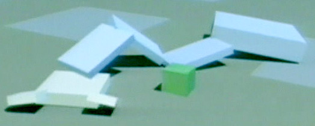

# Looking Outwards 01: Olars, Kinetic Toy & Evolution Simulation

### Lars Marcus Vedeler & Ola Vagsholm - Olars, Kinetic Toy, 2010

[Video Link: Lars Marcus Vedeler & Ola Vagsholm - Olars, Kinetic Toy](https://www.youtube.com/watch?v=2MA0RdjwRQ0)

[Project Images: Olars, Kinetic Toy](http://www.ahodesign.no/ahodesign_english/project/olars-ola-vagsholm-lars-marcus-vedeler)

*Olars* is an electronic motorized interactive toy that features a variety of "limbs" which can be attached to the toy's torso to create different types of movement. The torso itself can be twisted and the joint rotations modified to create an even wider variety of movement. This project was created by Lars Marcus Vedeler & Ola Vagsholm at the Oslo School of Architecture and Design. They cite Karl Sims' "Evolved Virtual Creatures" as a major inspiration (more details on Sims' work in the next segment).

I like the idea of a mix-and-match critter whose movements are defined by its parts. On an aesthetic level, I enjoy the variety of shapes, motion, and the colorful design of *Olars*, which are well represented in its documentation video. However, since not many of the limb combinations showcased produce effective movement, I wold have like to see some of the more outlandish combinations (but in the scheme of things, this is a very minor criticism). If this project were to be expanded upon, I would like to see a basic level of interaction between two versions of the kinetic toy. 

### Karl Sims - Evolved Virtual Creatures, Evolution Simulation, 1994

[Video Link: Karl Sims - Evolved Virtual Creatures, Evolution Simulation](https://www.youtube.com/watch?v=JBgG_VSP7f8)

[Siggraph Paper: Evolving Virtual Creatures by Karl Sims](http://www.karlsims.com/papers/siggraph94.pdf)

As described by Karl Sims, "This video shows results from a research project involving simulated Darwinian evolutions of virtual block creatures. A population of several hundred creatures is created within a supercomputer, and each creature is tested for their ability to perform a given task, such the ability to swim in a simulated water environment. Those that are most successful survive, and their virtual genes containing coded instructions for their growth, are copied, combined, and mutated to make offspring for a new population. The new creatures are again tested, and some may be improvements on their parents. As this cycle of variation and selection continues, creatures with more and more successful behaviors can emerge." [(Source)](http://www.karlsims.com/evolved-virtual-creatures.html)

### Cubivore - Survival of the Fittest - Nintendo Gamecube, 2002

[Video Link: Cubivore Opening Screen](https://www.youtube.com/watch?v=MChGyF8LZ_4&t=1m0s)

The aesthetic style and the methods of locomotion showcased in the two above projects reminded me a bit of *Cubivore*, one of the weirder games to grace the Nintendo Gamecube. The creatures that appear in the game's opening screen do a good job of demonstrating various geometrically-based walking styles.