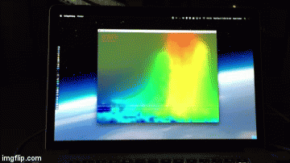

## Project #4: Concertmaster

Small movements can be translated to large actions. In earlier work, I have explored a longtime fascination with the ability for a conductor to command an entire symphony with hand gestures. The concertmaster traditionally wields considerable command. In this piece, the viewer can 'conduct' the lights on the [Pausch Bridge](http://www.cmu.edu/randyslecture/bridge.html) by gesturing in mid-air.

<iframe src="https://player.vimeo.com/video/148365603" width="500" height="281" frameborder="0" webkitallowfullscreen mozallowfullscreen allowfullscreen></iframe> <br /><a href="https://vimeo.com/148365603">on Vimeo</a>

### Implementation

The Randy Pausch Bridge has nearly 400 individually controllable 1' long RGB led strips arranged across the top and bottom of the side.

Connected to the lighting server for the bridge is a machine ('bridge server') that executes a custom Python script. The script starts a UDP server and lights up the specified lights at the specified colors. The [Lumiverse lighting control framework](http://lumiverse.cs.cmu.edu/) is used to simplify communication with the lighting server.

````
import socket
import sys
import lumiversepython as L
import time

rig = L.Rig("/home/teacher/Lumiverse/PBridge.rig.json")
rig.init()
rig.run()
deviceList = []

# Create a TCP/IP socket
sock = socket.socket(socket.AF_INET, socket.SOCK_DGRAM)

# Bind the socket to the port
server_address = ('**not shown**', 65000)
print >>sys.stderr, 'starting up on %s port %s' % server_address
sock.bind(server_address)

def init():

	# cache all of the device sets
	for x in xrange(188):
		top = rig.select("[$sequence=%d][$side=top]"%x)
		bottom = rig.select("[$sequence=%d][$side=bot]"%x)
		sides = [bottom,top]
		deviceList.append(sides);


def allOff():
	# using cached device sets
	for device in deviceList:
		device[0].setColorRGBRaw("color",0,0,0);
		device[1].setColorRGBRaw("color",0,0,0);


def run():
	print "here"
	init()
	allOff()
	while True:

		# how many bytes to listen for?
		data, address = sock.recvfrom(4500)

		if data:
			# break up arbitrary chunks of commands into individual ones
			# format will be sequence(int 1-188) | side(int 0 for bottom, 1 for top) | r(float) | g(float) | b(float) , next... 
			commands = [x.split('|') for x in data.split(',')]
			if(len(commands) > 0):
				for command in commands:
					if len(command) == 5:
						try:
							sequence = int(command[0]);
							side = int(command[1]);
							r = float(command[2]);
							g = float(command[3]);
							b = float(command[4]);
							# ok, make it so
							deviceList[sequence][side].setColorRGBRaw("color",r,g,b);
						except Exception as inst:
							print "\nskipping command ", type(inst)


run()
````

A [LEAP Motion](https://www.leapmotion.com/) is connected to a remote machine that executes a custom OpenFrameworks application. The application tracks the user's hands (using [ofxLeapMotion](https://github.com/ofTheo/ofxLeapMotion)), and populates the screen in various (toggle-able) ways. For example, one mode uses [OfxBox2d](https://github.com/vanderlin/ofxBox2d) to generate circles at the tip of each extended finger. A blur is applied to the entire visualization using [ofxBlur](https://github.com/kylemcdonald/ofxBlur).


A bar across the bottom of the screen denotes where the individual pixels will be captured to be sent to the bridge. The color and location of each pixel is transmitted by UDP over the network to the aforementioned Python script.



UDP was chosen because packet loss and packet ordering were not terribly important – instead, low latency is key. Optimal UDP packet sizes were derived empirically.

### Successes, failures, and opportunities

I hoped to create a piece that yielded a unique sense of power when used, and I accomplished that. The effect modes I chose are interesting, but I had hoped to create additional ones. For example, I look forward to creating one that used fluid simulation (perhaps where the user's hands can mix and disrupt flows emanating from either end of the bridge.)


### Acknowledgements
Special thanks to Evan Shimizu for his advice, and for creating the [Lumiverse lighting control framework](http://lumiverse.cs.cmu.edu/), which was sponsored by the The Frank-Ratchye STUDIO for Creative Inquiry at Carnegie Mellon University
